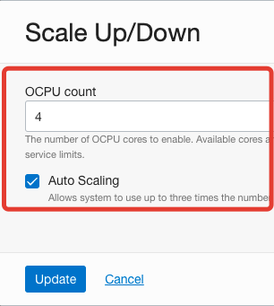
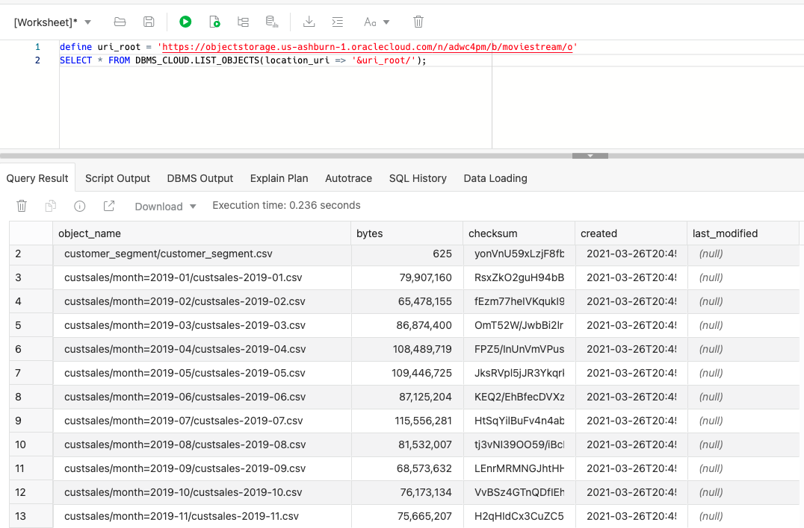
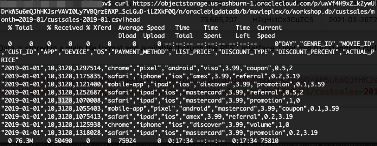
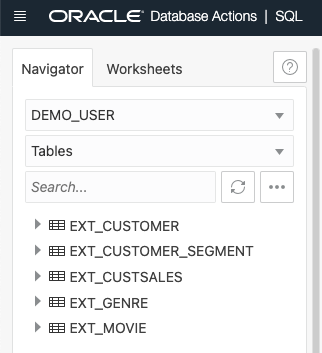
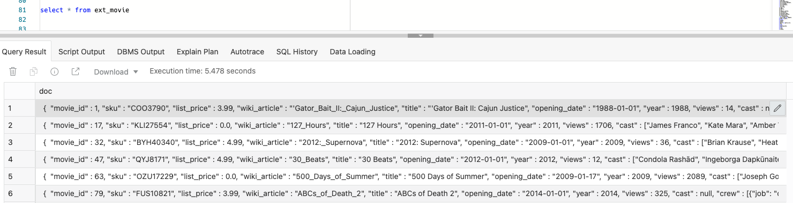
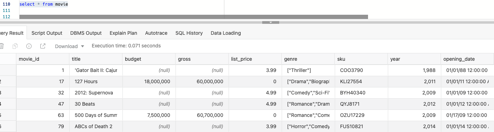
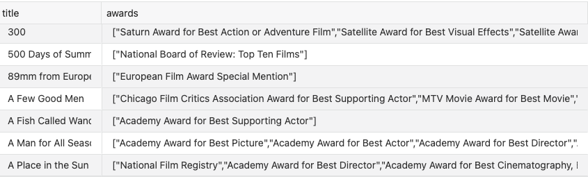
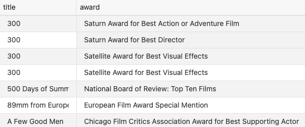
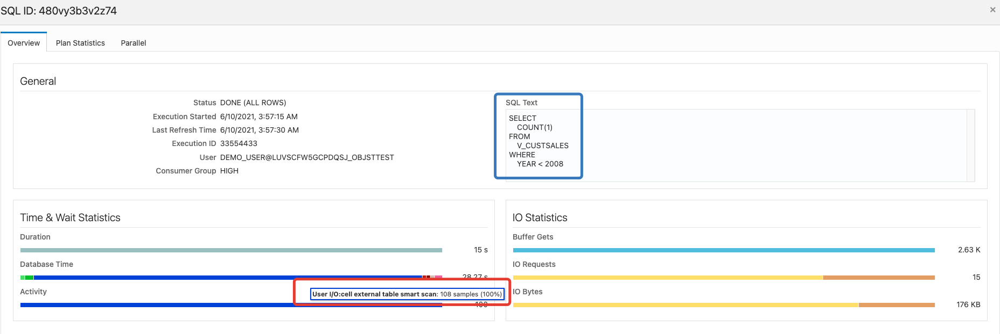

# ADB query accelerator

## Introduction

This lab walks you through the Steps to try ADB query accelerator. You will create metadata Objects on top of shared dataset and run set of the queries

Estimated Lab Time: 20 minutes

### Background
Oracle Autonomous Database was able to query external dataset for quite some time. Recently product team introduced acceleration feature for this, which allows to run the same queries without any code change, but way faster.

### Objectives

In this lab, you will:
* Get familiar with a concept of external processing for ADW
* Define test dataset and run some queries to analyze these data
* Confirm efficiency of external processing

### Prerequisites

* An Oracle Cloud Account
* Pre-created ADW with 4 OCPUs (this is recommended, but not mandatory number)
* ADW auto-scale feature should be enabled
    

## **Step 1 (Optional)**: Create User
To run this Quick Start guide there is recommendation to create dedicated account. It will help isolate testing from other database activities

As ADMIN user run following scripts:
```
CREATE USER demo_user IDENTIFIED BY "SuperSecurePassw0rd!@12345" ACCOUNT UNLOCK;
GRANT CREATE SESSION TO demo_user;
GRANT DWROLE TO demo_user;
GRANT ALTER SESSION TO demo_user;
GRANT UNLIMITED TABLESPACE TO demo_user;
-- Enable REST endpoint for be able to use SQL Developer Web
BEGIN  Developer Web
    ords_admin.enable_schema (
        p_enabled               => TRUE,
        p_schema                => 'DEMO_USER',
        p_url_mapping_type      => 'BASE_PATH',
        p_auto_rest_auth        => TRUE   -- this flag says, don't expose my REST APIs
    );
    COMMIT;
END;
/
```
Also, issue these grants, it will be used later on
```
grant select on v$statname to public;
grant select on v$mystat to public;
```
In case you are planning to switch the resource group within SQL Developer Web (recommended), issue this grants
```
grant ALTER SESSION to DEMO_USER;
grant SELECT ON SYS.V_$SERVICES to DEMO_USER;
grant SELECT ON SYS.GV_$SERVICES to DEMO_USER;
grant EXECUTE ON DBMS_SESSION to DEMO_USER;
grant SELECT ON DBA_RSRC_CONSUMER_GROUP_PRIVS to DEMO_USER;
```

## **Step 2**: Define external tables

1. Explore Objects available in the public bucket. These dataset are owned by Oracle and hosted in Oracle's tenancy. It shows sales and customers data for fiction video content provider called Movieplex
```
define uri_root = 'https://objectstorage.us-ashburn-1.oraclecloud.com/p/uwVf4H9xZ_k2ywUDrkW5u6mQJhHKJsrVAVI0Ly7VBQrzEWXP_ScLGuD-iLZXkF0Q/n/oraclebigdatadb/b/movieplex/o/workshop.db'
SELECT * FROM DBMS_CLOUD.LIST_OBJECTS(location_uri => '&uri_root/');
```
In a SQL Developer Web it will looks like:
    
2. Preview data
Data is stored in a plain file format and available though a REST interface. User can run standard curl command from bash environment to preview data
```
$ curl https://objectstorage.us-ashburn-1.oraclecloud.com/p/uwVf4H9xZ_k2ywUDrkW5u6mQJhHKJsrVAVI0Ly7VBQrzEWXP_ScLGuD-iLZXkF0Q/n/oraclebigdatadb/b/movieplex/o/workshop.db/custsales/month=2019-01/custsales-2019-01.csv|head
```
Example of output:
    

3. Create set of the external tables, mapped to the public bucket
```
define uri_root = 'https://objectstorage.us-ashburn-1.oraclecloud.com/p/uwVf4H9xZ_k2ywUDrkW5u6mQJhHKJsrVAVI0Ly7VBQrzEWXP_ScLGuD-iLZXkF0Q/n/oraclebigdatadb/b/movieplex/o/workshop.db'
define csv_format = '{"dateformat":"YYYY-MM-DD", "skipheaders":"1", "delimiter":",", "removequotes":"true"}'
define json_format = '{"skipheaders":"0", "ignoreblanklines":"true"}'

BEGIN
     dbms_cloud.create_external_table(
        table_name => 'ext_customer_segment',
        file_uri_list => '&uri_root/customer_segment/customer_segment.csv',
        format => '&csv_format',
        column_list => 'segment_id number, name varchar2(100), short_name varchar2(100)'
        );   
    dbms_cloud.create_external_table(
        table_name => 'ext_genre',
        file_uri_list => '&uri_root/genre/genre.csv',
        format => '&csv_format',
        column_list => 'genre_id number, name varchar2(30)'
        );
     dbms_cloud.create_external_table(
        table_name => 'ext_movie',
        file_uri_list => '&uri_root/movie/movies.json',
        format => '&json_format',
        column_list => 'doc varchar2(30000)'
        );
     dbms_cloud.create_external_table(
        table_name => 'ext_custsales',
        file_uri_list => '&uri_root/custsales/*.csv',
        format => '&csv_format',
        column_list => 'day date, genre_id number, movie_id number, cust_id number, app varchar2(30), device varchar2(30), os varchar2(30), payment_method varchar2(30), list_price number, discount_type varchar2(30), discount_percent number,actual_price number'
        );  
    dbms_cloud.create_external_table(
        table_name => 'ext_customer',
        file_uri_list => '&uri_root/customer/*.csv',
        format => '&csv_format',
        column_list => 'CUST_ID	NUMBER,
                        LAST_NAME	VARCHAR2(200 BYTE),
                        FIRST_NAME	VARCHAR2(200 BYTE),
                        STREET_ADDRESS	VARCHAR2(400 BYTE),
                        POSTAL_CODE	VARCHAR2(10 BYTE),
                        CITY	VARCHAR2(100 BYTE),
                        STATE_PROVINCE	VARCHAR2(100 BYTE),
                        COUNTRY	VARCHAR2(400 BYTE),
                        COUNTRY_CODE	VARCHAR2(2 BYTE),
                        CONTINENT	VARCHAR2(400 BYTE),
                        AGE	NUMBER,
                        COMMUTE_DISTANCE	NUMBER,
                        CREDIT_BALANCE	NUMBER,
                        EDUCATION	VARCHAR2(40 BYTE),
                        EMAIL	VARCHAR2(500 BYTE),
                        FULL_TIME	VARCHAR2(40 BYTE),
                        GENDER	VARCHAR2(20 BYTE),
                        HOUSEHOLD_SIZE	NUMBER,
                        INCOME	NUMBER,
                        INCOME_LEVEL VARCHAR2(20 BYTE),
                        INSUFF_FUNDS_INCIDENTS	NUMBER,
                        JOB_TYPE	VARCHAR2(200 BYTE),
                        LATE_MORT_RENT_PMTS	NUMBER,
                        MARITAL_STATUS	VARCHAR2(8 BYTE),
                        MORTGAGE_AMT	NUMBER,
                        NUM_CARS	NUMBER,
                        NUM_MORTGAGES	NUMBER,
                        PET	VARCHAR2(40 BYTE),
                        PROMOTION_RESPONSE	NUMBER,
                        RENT_OWN	VARCHAR2(40 BYTE),
                        SEGMENT_ID	NUMBER,
                        WORK_EXPERIENCE	NUMBER,
                        YRS_CURRENT_EMPLOYER	NUMBER,
                        YRS_CUSTOMER	NUMBER,
                        YRS_RESIDENCE	NUMBER,
                        LOC_LAT	NUMBER,
                        LOC_LONG	NUMBER'
        );  
END;
/
```
Here is the list of the tables
    

4. After tables been created, check actual DDL:
```
select dbms_metadata.get_ddl('TABLE','EXT_CUSTSALES','DEMO_USER') from DUAL;
----------------------------------------------------------------------------
----------------------------------------------------------------------------
  CREATE TABLE "DEMO_USER"."EXT_CUSTSALES"
   (	"DAY" DATE,
	"GENRE_ID" NUMBER,
	"MOVIE_ID" NUMBER,
	"CUST_ID" NUMBER,
	"APP" VARCHAR2(30) COLLATE "USING_NLS_COMP",
	"DEVICE" VARCHAR2(30) COLLATE "USING_NLS_COMP",
	"OS" VARCHAR2(30) COLLATE "USING_NLS_COMP",
	"PAYMENT_METHOD" VARCHAR2(30) COLLATE "USING_NLS_COMP",
	"LIST_PRICE" NUMBER,
	"DISCOUNT_TYPE" VARCHAR2(30) COLLATE "USING_NLS_COMP",
	"DISCOUNT_PERCENT" NUMBER,
	"ACTUAL_PRICE" NUMBER
   )  DEFAULT COLLATION "USING_NLS_COMP"
   ORGANIZATION EXTERNAL
    ( TYPE ORACLE_BIGDATA
      DEFAULT DIRECTORY "DATA_PUMP_DIR"
      ACCESS PARAMETERS
      ( com.oracle.bigdata.fileformat=textfile
com.oracle.bigdata.dateformat='YYYY-MM-DD'
com.oracle.bigdata.csv.skip.header=1
com.oracle.bigdata.csv.rowformat.fields.terminator=','
com.oracle.bigdata.removequotes=true
com.oracle.bigdata.trimspaces=notrim
  )
      LOCATION
       ( 'https://objectstorage.us-ashburn-1.oraclecloud.com/p/uwVf4H9xZ_k2ywUDrkW5u6mQJhHKJsrVAVI0Ly7VBQrzEWXP_ScLGuD-iLZXkF0Q/n/oraclebigdatadb/b/movieplex/o/workshop.db/custsales/*.csv'
       )
    )
   REJECT LIMIT 0
  PARALLEL
```

5. Check JSON Data, describing movies. In a SQL Developer Web it will looks like:
    

it's not a big table, so we can put it into database. Also we will parse JSON and convert it into a structure:
```
create table movie as
select
    cast(m.doc.movie_id as number) as movie_id,
    cast(m.doc.title as varchar2(200 byte)) as title,    
    cast(m.doc.genre as varchar2(4000)) as genre,
    cast(m.doc.year as number) as year,
    to_date(m.doc.opening_date, 'YYYY-MM-DD') as opening_date,
    cast(m.doc.views as number) as views,
    cast(m.doc.cast as varchar2(4000 byte)) as cast,
    cast(m.doc.crew as varchar2(4000 byte)) as crew,
    cast(m.doc.main_subject as varchar2(4000 byte)) as main_subject,
    cast(m.doc.awards as varchar2(4000 byte)) as awards,
    cast(m.doc.runtime as number) as runtime,
from ext_movie m;
```
After data loading, new structure will looks like this:
    

6. Oracle SQL makes JSON look familiar. JSON_TABLE is a powerful function that will perform a lateral join - creating a row for each award for movies. Awards are now easily queried
```
select title, awards
from movie   
where awards is not null
order by title;
```
Output for raw data will looks like:
    
```
select title, award    
from movie, JSON_TABLE(awards, '$[*]' columns (award path '$')) jt
where awards is not null
order by title;
```
Data after transformation:
    
7. Load other dimension tables into database from Object Store:
```
create table genre as select * from ext_genre;
create table customer_segment as select * from ext_customer_segment;
create table customer as select * from ext_customer;
```
CUSTSALES is relatively big table, leave it in Object store and create one view on top of all tables:
```
CREATE OR REPLACE VIEW v_custsales AS
SELECT
    cs.day,
    c.cust_id,
    c.last_name,
    c.first_name,
    c.city,
    c.state_province,
    c.country,
    c.continent,
    c.age,
    c.commute_distance,
    c.credit_balance,
    c.education,
    c.full_time,
    c.gender,
    c.household_size,
    c.income,
    c.income_level,
    c.insuff_funds_incidents,
    c.job_type,
    c.late_mort_rent_pmts,
    c.marital_status,
    c.mortgage_amt,
    c.num_cars,
    c.num_mortgages,
    c.pet,
    c.promotion_response,
    c.rent_own,
    c.work_experience,
    c.yrs_current_employer,
    c.yrs_customer,
    c.yrs_residence,
    c.loc_lat,
    c.loc_long,    
    cs.app,
    cs.device,
    cs.os,
    cs.payment_method,
    cs.list_price,
    cs.discount_type,
    cs.discount_percent,
    cs.actual_price,
    1 as transactions,
    s.short_name as segment,
    g.name as genre,
    m.title,
    m.genre as genre_list,
    m.year,
    m.opening_date,
    m.cast,
    m.crew,
    m.main_subject,
    nvl(json_value(m.awards,'$.size()'),0) awards,
    m.runtime
FROM
    genre g, customer c, ext_custsales cs, customer_segment s, movie m
WHERE
     cs.movie_id = m.movie_id
AND  cs.genre_id = g.genre_id
AND  cs.cust_id = c.cust_id
AND  c.segment_id = s.segment_id;
```
## **Step 3:** Run Queries

1. Prepare the view to monitor efficiency of offloading
```
create view xt_stat as
SELECT
    N.NAME,
    VALUE
FROM
    V$MYSTAT    S,
    V$STATNAME  N
WHERE
    S.STATISTIC# = N.STATISTIC#
    AND N.NAME IN (
    'cell XT granules requested for predicate offload',
    'cell XT granule bytes requested for predicate offload',
    'cell interconnect bytes returned by XT smart scan',
    'cell XT granule predicate offload retries' );
```
2. Despite on processing done outside of database the core optimizer is still sits into Oracle database, so it's critical to gather statistics to get optimal query execution plan
```
BEGIN
  DBMS_STATS.GATHER_SCHEMA_STATS('DEMO_USER', options=>'GATHER AUTO');
END;
/
```

3. Now ready start to query data
Count number of purchases films older than 2008
```
select count(1) from v_custsales
where
year<2008;
```
and right after query above, select performance view to understand efficiency of external processing:
```
select * from xt_stat;

NAME                                                                  VALUE
---------------------------------------------------------------- ----------
cell XT granules requested for predicate offload                         43
cell XT granule bytes requested for predicate offload            3636585242
cell interconnect bytes returned by XT smart scan                    367736
cell XT granule predicate offload retries                                 0
```
This data shows us that totally it were 43 granules (unit of work automatically defined by database), which is 3636585242 bytes (~3.6GB). 367736 bytes (~350KB) were transferred back to database, rest were illuminated on the storage level

User also may wants to check fact of offload in SQL Monitor report:
    

*"cell external table smart scan"* is the event saying that processing been done outside of database.

4. A high level look at our customer movie preferences. Simple query to find out who (customer segment) is buying different types of movies (genres). Here, data is in the database.  But the data for these tables could also be stored in object store (or both). It's transparent to the application.

```
select cs.short_name as segment,
       g.name as genre,
	   sum(s.actual_price) as sales
from   customer c, customer_segment cs, genre g, ext_custsales s
where c.segment_id = cs.segment_id
  and s.genre_id = g.genre_id
  and c.cust_id = s.cust_id
group by cs.short_name, g.name
order by 1, 2;
```
5. How does this month compare to last year? Using LAG analytic function to compare this december's sales by genre to last year december
```
with sales_vs_lastyear as (
    select g.name as genre,
           to_char(c.day,'YYYY-MM') as month,
           sum(c.actual_price) sales,
           lag(sum(c.actual_price)) over (
                PARTITION BY g.name
                ORDER BY to_char(c.day,'YYYY-MM')
               ) as last_year,
           sum(c.actual_price) -
               lag(sum(c.actual_price)) over (
                    PARTITION BY g.name
                    ORDER BY to_char(c.day,'YYYY-MM')
                   ) as change_vs_last_year           
    from ext_custsales c, genre g
    where
      g.genre_id = c.genre_id
     and to_char(c.day, 'MON') in ('DEC')
    group by to_char(c.day,'YYYY-MM'), c.genre_id, g.name
    order by genre, month
)
select genre, change_vs_last_year "change vs last year"
from sales_vs_lastyear
where month='2020-12';
```
6. Is there an Academy Award bump?
```
with academyAwardedMovies as (
    select m.movie_id
    from movie m, JSON_TABLE(awards, '$[*]' columns (award path '$')) jt
    where jt.award like 'Academy%'
    and year > 2000
),
academyMovieSales as (
   select sales.movie_id, sales.day
   from ext_custsales sales
   where sales.movie_id in (select movie_id from academyAwardedMovies)
),
before2020Award as (
  select ams1.movie_id, count(1) as before_count
  from academyMovieSales ams1 where day between to_date('09/02/2020', 'DD/MM/YYYY') -14
                                            and to_date('09/02/2020', 'DD/MM/YYYY')
  group by ams1.movie_id
),
after2020Award as (
  select ams2.movie_id, count(1) as after_count
  from academyMovieSales ams2 where day between to_date('09/02/2020', 'DD/MM/YYYY')
                                            and to_date('09/02/2020', 'DD/MM/YYYY') +14
  group by ams2.movie_id
)
select
    title,
    substr(title, 1, 15) title_label,
    year,
    bef.before_count as "before event",
    aft.after_count as "after event",
    round((aft.after_count - bef.before_count)/bef.before_count * 100) as  "percent change"
from after2020Award aft, before2020Award bef, movie m
where aft.movie_id = bef.movie_id
and   aft.movie_id = m.movie_id
order by "percent change" DESC;
```

7. Use RFM - Recency, Frequency and Monetary analysis to categorize customer behavior.   Any big spenders that are not active? Look for customers in a High Spend quintile and Low Recency quintile
```
with rfm as (
    SELECT cs.cust_id,
         c.last_name,
         c.first_name,
         c.country,
         c.gender,
         c.age,
         c.income_level,
         NTILE (5) over (order by sum(cs.actual_price)) AS rfm_monetary,
         NTILE (5) over (order by max(cs.day)) AS rfm_recency,
         NTILE (5) over (order by count(1))    AS rfm_frequency
    FROM ext_custsales cs, customer c
    WHERE c.cust_id = cs.cust_id
    GROUP BY cs.cust_id,         
         c.last_name,
         c.first_name,
         c.country,
         c.gender,
         c.age,
         c.income_level
)
select *
from rfm
where
    rfm_monetary >= 4
and rfm_recency <= 2
order by rfm_monetary desc, rfm_recency asc
fetch first 200 rows only;
```
8. Are we always engage external processing? No. query accelerator runtime engine brings some overhead and it's not so efficient for a small dataset (overhead is higher than benefits), so external processing if not always used. Oracle has algorithm that defines whether use query accelerator or not and it depend on number of ADW base cores and amount of data into Object Store.

## **Step 4:** Use Data Lake capabilities

1. Imagine you need to count number of sales for each studio, but you don't bring "studio" column into a table movies (few steps above, database table been defined and dataset was loaded). It's not a problem, because you can go back to the source (external table) and run new query, using column you need:

```
SELECT count(1), m.doc.studio from ext_custsales cs, ext_movie m
WHERE
     cs.movie_id = m.doc.movie_id
group by m.doc.studio
```
This is one of the common use case, when user loads into database refined and cleaned data, while leave into Object Store detailed data, which always can be used on demand

## Learn More
* [Querying External Data with Autonomous Database](https://docs.oracle.com/en/cloud/paas/autonomous-database/adbsa/query-external.html#GUID-ABF95242-3E04-42FF-9361-52707D14E833)
* [Provision ADW instance](https://docs.oracle.com/en/cloud/paas/autonomous-data-warehouse-cloud/tutorial-getting-started-autonomous-db-adw/index.html)
